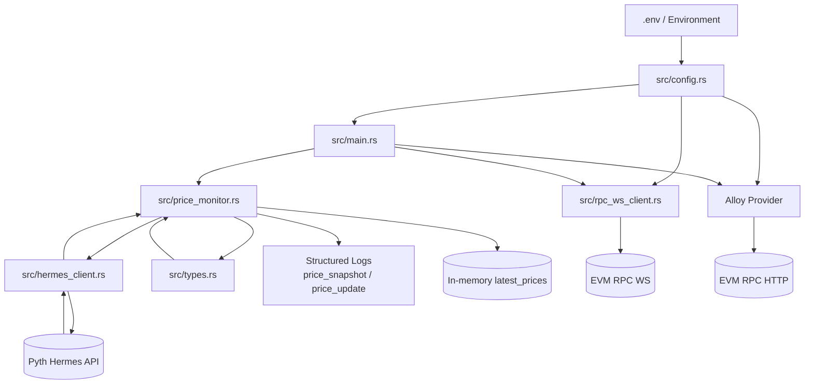

# Architecture

## High-Level Components

- `src/main.rs`: application entrypoint and orchestration
- `src/config.rs`: environment parsing, API-key interpolation, timezone parsing
- `src/hermes_client.rs`: Hermes REST + SSE transport
- `src/price_monitor.rs`: feed parsing, in-memory state, structured update logging
- `src/types.rs`: typed API payload models and price parsing logic
- `src/rpc_ws_client.rs`: optional Ethereum WS JSON-RPC path via `fastwebsockets`

## Data Flow

1. Load config from environment (`Config::from_env`).
2. Fetch initial price snapshot from Hermes.
3. Log normalized structured snapshot events.
4. Connect to optional Ethereum RPC (WS preferred, HTTP fallback).
5. Start Hermes SSE stream.
6. Parse each incoming price update, enrich timestamps, emit structured logs, update in-memory cache.

## Mermaid Diagram



## Module Interfaces

- `Config::from_env()`
  - resolves env vars
  - interpolates API key placeholders
  - validates timezone option

- `HermesClient`
  - `get_latest_price_updates(&[String])`
  - `stream_price_updates(&[String])`

- `PriceMonitor`
  - `fetch_latest_once()`
  - `start_streaming()`
  - `get_latest_prices()`

- `rpc_ws_client::get_latest_block_number(endpoint)`
  - handshake via `fastwebsockets`
  - `eth_blockNumber` JSON-RPC request/response

## Pyth Network and Hermes

### Hermes API

Hermes is Pyth's off-chain price service that provides:

- REST API for latest price queries
- Server-Sent Events (SSE) for real-time streaming
- 400+ price feeds across multiple asset classes
- Sub-second latency for price updates

### Price Structure

Each price feed includes:

- **Price**: current price with confidence interval
- **EMA Price**: exponentially-weighted moving average
- **Exponent**: power of 10 to multiply the raw price by
- **Publish Time**: Unix timestamp of price publication

### Price Calculation

Raw prices are integers that must be adjusted by the exponent:

```
actual_price = price * 10^expo
```

Example:

- Raw price: `4426101900000`
- Exponent: `-8`
- Actual price: `44261.019` USD

### Common Price Feed IDs

Find the full list at: https://pyth.network/developers/price-feed-ids

| Feed    | ID |
|---------|----|
| BTC/USD | `0xe62df6c8b4a85fe1a67db44dc12de5db330f7ac66b72dc658afedf0f4a415b43` |
| ETH/USD | `0xff61491a931112ddf1bd8147cd1b641375f79f5825126d665480874634fd0ace` |
| SOL/USD | `0xef0d8b6fda2ceba41da15d4095d1da392a0d2f8ed0c6c7bc0f4cfac8c280b56d` |

## Alloy Integration

The codebase demonstrates Alloy integration for:

- Connecting to Ethereum nodes
- Fetching current block numbers
- Querying account balances
- Readiness for smart contract interactions

## Production Considerations

1. **Private Hermes Endpoint**: for production, consider a private Hermes endpoint (e.g., Triton One) for better reliability.
2. **Reconnection Logic**: the SSE stream auto-closes after 24 hours; implement reconnection with exponential backoff.
3. **Rate Limiting**: monitor request rates when using the public endpoint.
4. **Error Recovery**: use exponential backoff for connection retries.
5. **Data Persistence**: store price history in a database for analytics.
