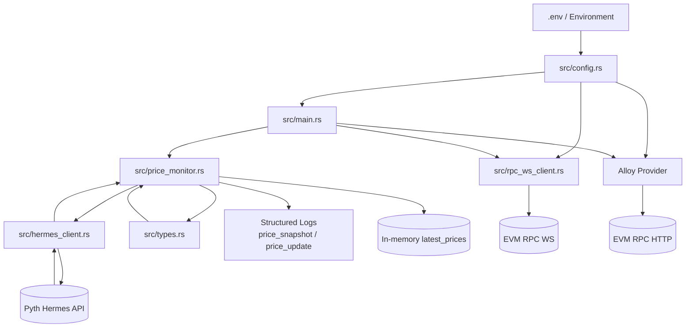

# Architecture

## High-Level Components

- `src/main.rs`: application entrypoint and orchestration
- `src/config.rs`: environment parsing, API-key interpolation, timezone parsing
- `src/hermes_client.rs`: Hermes REST + SSE transport
- `src/price_monitor.rs`: feed parsing, in-memory state, structured update logging
- `src/types.rs`: typed API payload models and price parsing logic
- `src/rpc_ws_client.rs`: optional Ethereum WS JSON-RPC path via `fastwebsockets`

## Data Flow

1. Load config from environment (`Config::from_env`).
2. Fetch initial price snapshot from Hermes.
3. Log normalized structured snapshot events.
4. Connect to optional Ethereum RPC (WS preferred, HTTP fallback).
5. Start Hermes SSE stream.
6. Parse each incoming price update, enrich timestamps, emit structured logs, update in-memory cache.

## Mermaid Diagram

## Module Interfaces

- `Config::from_env()`
  - resolves env vars
  - interpolates API key placeholders
  - validates timezone option

- `HermesClient`
  - `get_latest_price_updates(&[String])`
  - `stream_price_updates(&[String])`

- `PriceMonitor`
  - `fetch_latest_once()`
  - `start_streaming()`
  - `get_latest_prices()`

- `rpc_ws_client::get_latest_block_number(endpoint)`
  - handshake via `fastwebsockets`
  - `eth_blockNumber` JSON-RPC request/response
